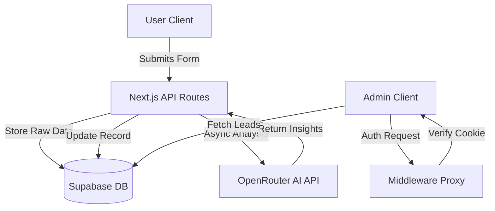

# 🚀 AI-Powered Lead Management Ecosystem

<div align="center">


### Intelligent Lead Qualification & Modern Dashboard Architecture

[Live Demo](https://ai-lead-management-tool.vercel.app/) · [Report Bug](https://github.com/bhargav3929/ai-lead-management-tool/issues) · [Request Feature](https://github.com/bhargav3929/ai-lead-management-tool/issues)

</div>

---

## 📖 Executive Summary

This project is not just a form; it's a **comprehensive, production-grade technical assessment** demonstrating modern web engineering practices. It bridges the gap between user acquisition and operational efficiency by employing **Generative AI** to instantly qualify potential clients.

Built to showcase proficiency in **Full-Stack Development**, **System Design**, and **UX Engineering**, this application features a secure, responsive admin dashboard protected by custom middleware and powered by a scalable PostgreSQL backend.

## 🌟 Key Technical Highlights

### 🤖 AI-First Architecture
Instead of passive data collection, this system actively processes information:
- **Instant Analysis**: Integrates **LLM (Large Language Model)** capabilities via OpenRouter/Mistral APIs.
- **Smart Scoring**: Automatically categorizes leads as **Hot, Warm, or Cold** based on budget, timeline, and requirement sentiment.
- **Actionable Insights**: Generates executive summaries and suggested next steps for sales teams.

### 🎨 Premium UI/UX Design
Focus on "Wow Factor" and usability:
- **Glassmorphism Design System**: Advanced CSS techniques for a modern, frosted-glass aesthetic.
- **Micro-Interactions**: Smooth animations using **Framer Motion** to guide user flow.
- **Responsive Layout**: Mobile-first architecture ensuring perfect rendering on all devices.
- **Dynamic Feedback**: Real-time validation and toast notifications (Sonner) for superior user feedback loops.

### 🛡️ Enterprise-Grade Security
- **Middleware Protection**: Custom Next.js Middleware (`proxy`) to secure private routes (`/dashboard`).
- **Row Level Security (RLS)**: Supabase policies ensuring data integrity and access control.
- **HttpOnly Cookies**: Secure authentication flow simulation.

## 🛠️ Technology Stack

| Layer | Technology | Rationale |
|-------|------------|-----------|
| **Framework** | **Next.js 15+ (App Router)** | For server-side rendering, SEO, and robust routing. |
| **Language** | **TypeScript** | For type safety, maintainability, and developer experience. |
| **Styling** | **Tailwind CSS** | For rapid UI development and design consistency. |
| **Database** | **Supabase (PostgreSQL)** | For scalable, relational data storage with real-time capabilities. |
| **AI/ML** | **OpenRouter API** | Accessing state-of-the-art LLMs for lead processing. |
| **UI Library** | **Shadcn/UI + Lucide** | Accessible, reusable component primitives. |
| **State** | **React Hooks + Server Actions** | Modern state management patterns. |

## 🚀 Quick Start Guide

Ready to deploy or test locally? Follow these steps.

### Prerequisites
- Node.js 18+
- A Supabase Project
- An OpenRouter API Key

### 1. Clone & Install
```bash
git clone https://github.com/bhargav3929/ai-lead-management-tool.git
cd lead-dashboard
npm install
```

### 2. Configure Environment
Create a `.env.local` file in the root directory:
```env
NEXT_PUBLIC_SUPABASE_URL=your_supabase_url
NEXT_PUBLIC_SUPABASE_ANON_KEY=your_supabase_anon_key
OPENROUTER_API_KEY=your_openrouter_key
```

### 3. Database Setup (SQL)
Run this SQL script in your Supabase SQL Editor to initialize the schema:
```sql
CREATE TABLE leads (
  id UUID PRIMARY KEY DEFAULT gen_random_uuid(),
  name TEXT NOT NULL,
  email TEXT NOT NULL,
  phone TEXT NOT NULL,
  business_type TEXT NOT NULL,
  requirement TEXT NOT NULL,
  ai_summary TEXT,
  lead_quality_score TEXT,
  suggested_next_action TEXT,
  created_at TIMESTAMPTZ DEFAULT NOW(),
  updated_at TIMESTAMPTZ DEFAULT NOW()
);
```

### 4. Run Locally
```bash
npm run dev
```
Visit `http://localhost:3000` to see the application in action.
- **Admin Portal**: `/login` (User: `admin`, Pass: `admin123`)

## 💡 System Architecture



## 👨‍💻 Why This Implementation?

This project demonstrates the ability to translate business requirements into technical solutions effectively:
- **Scalability**: The separation of frontend, backend, and database allows independent scaling.
- **Maintainability**: Strict TypeScript typing and component-based architecture (Atomic Design principles).
- **User Experience**: Prioritizing perceived performance and visual delight to increase engagement.

---

<div align="center">

**Built with ❤️ by Bhargav**
*Full-Stack Engineer & AI Enthusiast*

</div>
